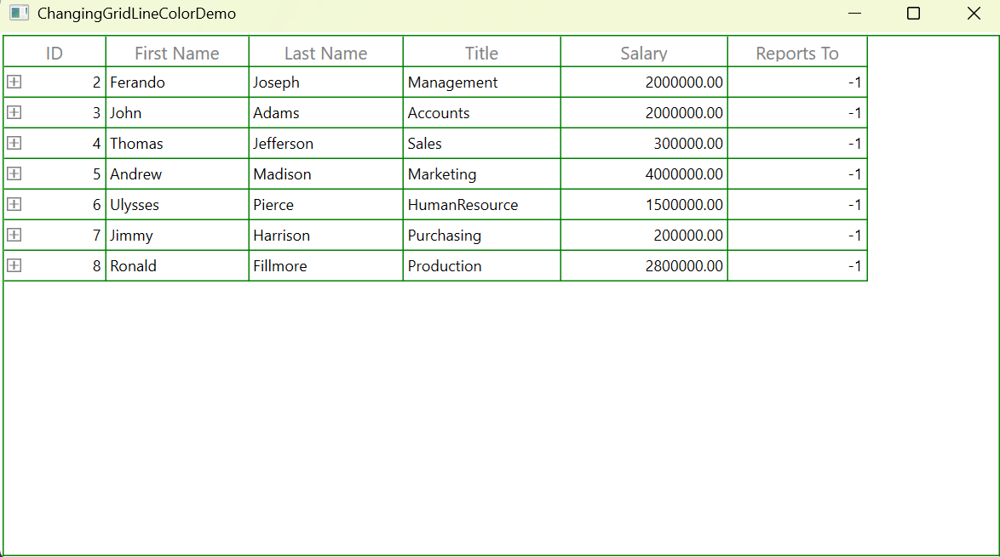

# How to change gridline color in a WPF TreeGrid

In [WPF SfTreeGrid](https://www.syncfusion.com/wpf-controls/treegrid), the grid line color can be customized by setting the BorderBrush property on the [TreeGridCell](https://help.syncfusion.com/cr/wpf/Syncfusion.UI.Xaml.TreeGrid.TreeGridCell.html), [TreeGridHeaderCell](https://help.syncfusion.com/cr/wpf/Syncfusion.UI.Xaml.TreeGrid.TreeGridHeaderCell.html), [TreeGridExpanderCell](https://help.syncfusion.com/cr/wpf/Syncfusion.UI.Xaml.TreeGrid.TreeGridExpanderCell.html), and the SfTreeGrid.

 ```xml
<Window.Resources>
    <!--To change the grid line color for the TreeGridCell-->
    <Style TargetType="syncfusion:TreeGridCell">
        <Setter Property="BorderBrush" Value="Green" />
    </Style>
    <!--To change the grid line color for the TreeGridHeaderCell-->
    <Style TargetType="syncfusion:TreeGridHeaderCell">
        <Setter Property="BorderBrush" Value="Green" />
    </Style>
    <!--To Change the grid line color for the TreeGridExpanderCell-->
    <Style TargetType="syncfusion:TreeGridExpanderCell">
        <Setter Property="BorderBrush" Value="Green" />
    </Style>
</Window.Resources>

<Grid>
    <syncfusion:SfTreeGrid Name="treeGrid"    
                           BorderBrush="Green"
                           ChildPropertyName="ReportsTo"
                           ItemsSource="{Binding Employees}"
                           ParentPropertyName="ID"
                           AllowEditing="True"
                           SelfRelationRootValue="-1">
    </syncfusion:SfTreeGrid>
</Grid> 
 ```
 

Take a moment to peruse the [WPF SfTreeGrid - GridLines](https://help.syncfusion.com/wpf/treegrid/gridlines) documentation, to learn more about SfTreeGrid GridLines customization with examples.